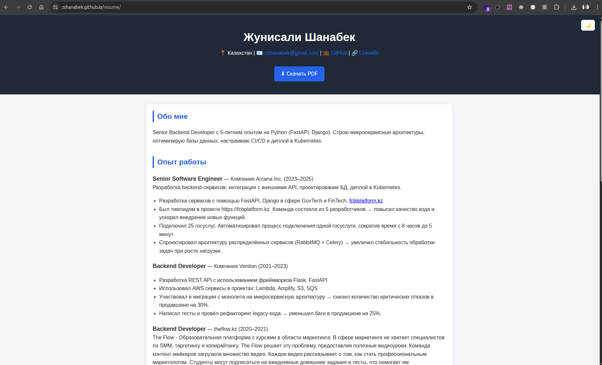

# Resume

My resume built with HTML, CSS, and JavaScript.

## Preview



## Features

- Dark mode
- Responsive design
- Customizable colors
- Downloadable PDF

## Usage

1. Clone the repository:

```bash
git clone https://github.com/zshanabek/resume.git
```

2. Open `index.html` in your web browser to view the resume.

## Customization

You can customize the colors and styles of the resume by editing the CSS file.
